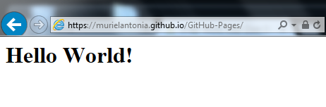
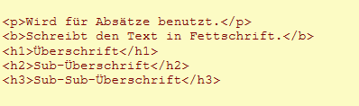
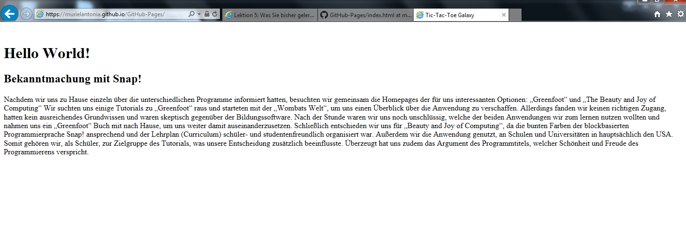
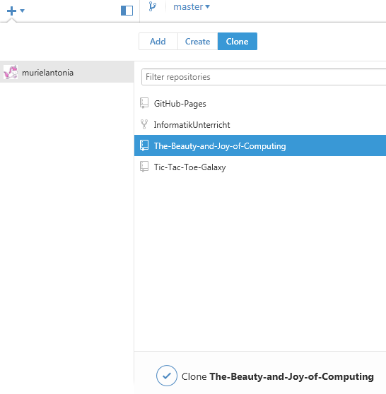
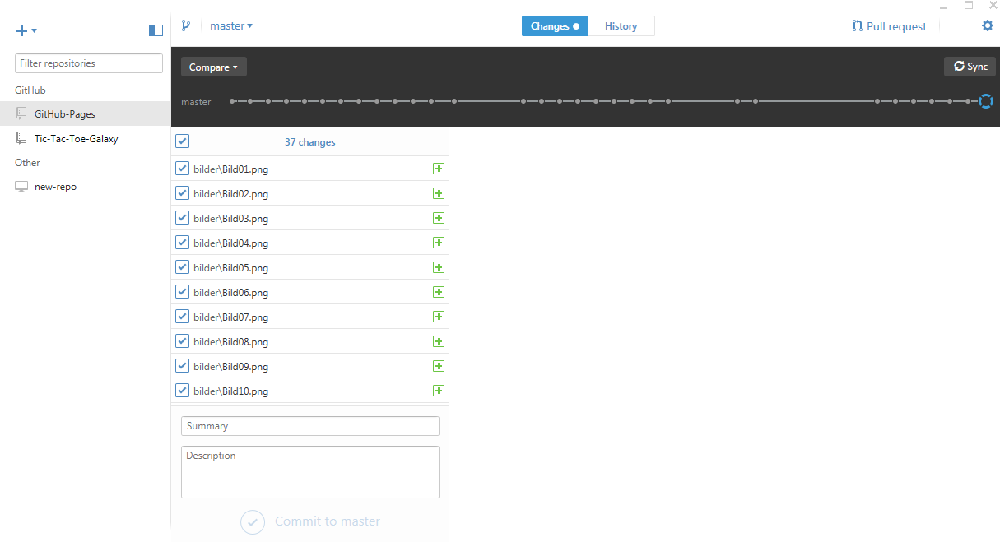
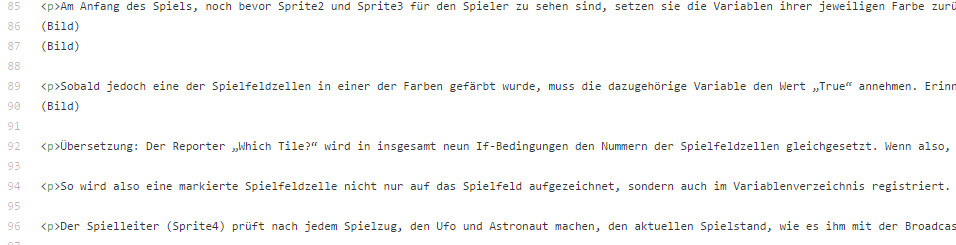
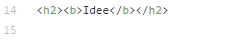
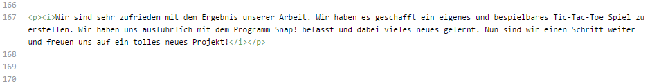
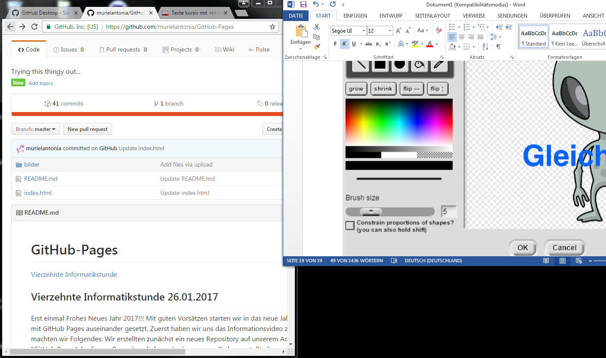

#GitHub-Pages
[Vierzehnte Informatikstunde](#vierzehn)

[Fünfzehnte Informatikstunde](#fünfzehn)

##Vierzehnte Informatikstunde<a name="vierzehn"><a/>                                                               26.01.2017

Erst einmal Frohes Neues Jahr 2017!!! Mit guten Vorsätzen starten wir in das neue Jahr....
Heute haben wir uns das erste Mal mit GitHub Pages auseinander gesetzt. Zuerst haben wir uns das Informationsvideo zu GitHub Pages angeschaut. Für Website machten wir Folgendes:
Wir erstellten zunächst ein neues Repository auf unserem Account murielantonia unter dem Titel "GitHub Pages". In diesem Repository haben wir einen neuen Ordner erstellt, der aus einer read.me Datei und einer index.html Datei besteht. In den index.html Ordner können wir nun den Quellcode für unsere Website programmieren. Unsere erste Zeile HTML-Code zeigt den Schriftzug "Hello World!" auf einer leeren Seite unter folgendem Link: https://murielantonia.github.io/GitHub-Pages/ 

Mit Hilfe eines Online Tutorials haben wir begonnen, uns erste Befehle in HTML anzueignen. Beispielhaft fügten wir den ersten Paragraphen aus unserem Tic-Tac-Toe Galaxy Dokument ein. Wir nutzten auch das neu errungene Wissen, um passende Überschriften zu formulieren und formatieren.

So sieht unsere Website nach aktuellem Stand aus:

##Fünfzehnte Informatikstunde<a name="fünfzehn"><a/>                                                                09.02.2017

Heute haben wir erfolgreich GitHub Desktop heruntergeladen. Damit konnten wir vereinfacht den Bilderordner aus der Tic-Tac-Toe Galaxy in den GitHub-Pages Ordner übertragen.
Zunächst mussten wir unsere Projekte in die Desktopversion clonen.

Danach konnten wir auf unserem Desktop die Bilderordner mit drag-and-drop verschieben.

War dies vollbracht, mussten wir nur noch unser Werk synchronisieren, damit die Bilder im Dokument erscheinen konnten. 

Nun arbeiteten wir weiter an unserer Website. Dazu haben wir den Text aus dem Tic-Tac-Toe Galaxy Projekt in die index.html File kopiert und in Paragraphen unterteilt.Die Überschriften haben wir in fett und die Zusammenfassung in kursiv geschrieben. Damit wir später wissen, an welche Stellen die Bilder eingefügt werden sollen, haben wir uns Notizen dazu gemacht.

Um uns die Arbeit zu erleichtern, haben wir den Text der Tic-Tac-Toe Galaxy in ein leeres Worddokument kopiert, damit wir gleichzeitig in zwei Fenstern arbeiten konnten.

Der Versuch ein Inhaltsverzeichnis zu erstellen ist leider gescheitert...

")

