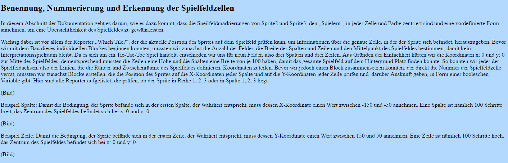

#GitHub-Pages
[Vierzehnte Informatikstunde](#vierzehn)

[Fünfzehnte Informatikstunde](#fünfzehn)

[Zusätzliche Informatikstunde](#zusatz)

[Sechzehnte informatikstunde](#sechzehn)

[Siebzehnte Informatikstunde](#siebzehn)

[Zusätzliche Informatikstunde](#zusätzlich)

##Vierzehnte Informatikstunde<a name="vierzehn"><a/>                                                               26.01.2017

Frohes Neues Jahr 2017!!! Mit guten Vorsätzen starten wir in das neue Jahr!
Heute haben wir uns das erste Mal mit GitHub Pages auseinander gesetzt, da wir uns zum Ziel gesetzt haben, unser Tic-Tac-Toe Spiel und die dazugehörigen Dokumentationen / Erklärungen auf einer eigenen Website zu präsentieren. Zuerst haben wir uns das Informationsvideo zu GitHub Pages angeschaut. Um eine Website zu programmieren, die im Browser dargestellt werden kann, benötigt man Grundkenntnisse in HTML (Hypertext Markup Language). Dabei handelt es sich um eine Auszeichnungssprache, die dazu dient, Texte, Bilder und Hyperlinks zu strukturieren. Zwar kann man mithilfe von GitHub Pages aus verschiedenen Vorformaten und Themen auswählen, die optisch ansprechend sind, wir haben uns jedoch dazu entschieden, von ganz unten zu beginnen und keine Formatvorlagen zu verwenden ("Start from scratch").

Wir erstellten zunächst ein neues Repository auf unserem Account murielantonia unter dem Titel "GitHub Pages". In diesem Repository haben wir einen neuen Ordner angelegt, der aus einer read.me Datei und einer index.html Datei besteht. In den index.html Ordner können wir nun den Quellcode für unsere Website programmieren. Unsere erste Zeile HTML-Code zeigt den Schriftzug "Hello World!" auf einer leeren Seite unter folgendem Link: https://murielantonia.github.io/GitHub-Pages/ 

Mit Hilfe eines Online Tutorials haben wir begonnen, uns erste Befehle in HTML anzueignen. Beispielhaft fügten wir den ersten Paragraphen aus unserem Tic-Tac-Toe Galaxy Dokument ein. Wir nutzten auch das neu errungene Wissen, um passende Überschriften zu formulieren und formatieren. Die meisten HTML-Elemente, in unserem Fall Titel und Paragraphen, sind von einem Tag-Paar umrahmt, also von einem Start- und einem Endtag. Der Starttag besteht aus einem Kleiner-Zeichen und dem Namen des Elementes, bei der Überschrift "Hello World" sei es h1, und endet mit einem Größer-Zeichen. Der Endtag setzt sich zusammen aus Kleiner-Zeichen, Schrägstrich, Name des Elements (h1) und Größer-Zeichen. Das klingt komplizierter, als es eigentlich ist:

So sieht unsere Website nach aktuellem Stand aus:

##Fünfzehnte Informatikstunde<a name="fünfzehn"><a/>                                                                09.02.2017

Heute haben wir erfolgreich GitHub Desktop heruntergeladen. Damit konnten wir vereinfacht den Bilderordner aus der Tic-Tac-Toe Galaxy in den GitHub-Pages Ordner übertragen.
Zunächst mussten wir unsere Projekte in die Desktopversion clonen.

Danach konnten wir auf unserem Desktop die Bilderordner mit drag-and-drop verschieben.

War dies vollbracht, mussten wir nur noch unser Werk synchronisieren, damit die Bilder im Dokument erscheinen konnten. 

Nun arbeiteten wir weiter an unserer Website. Dazu haben wir den Text aus dem Tic-Tac-Toe Galaxy Projekt in die index.html File kopiert und in Paragraphen unterteilt.Die Überschriften haben wir in fett und die Zusammenfassung in kursiv geschrieben. Damit wir später wissen, an welche Stellen die Bilder eingefügt werden sollen, haben wir uns Notizen dazu gemacht (Bild).

Um uns die Arbeit zu erleichtern, haben wir den Text der Tic-Tac-Toe Galaxy in ein leeres Worddokument kopiert, damit wir gleichzeitig in zwei Fenstern arbeiten konnten.

Unser Versuch, ein Inhaltsverzeichnis mit Hyperlinks zu erstellen, ist zunächst leider gescheitert.

##Zusätzliche Informatikstunde<a name="zusatz"><a/>                                                                   13.02.2017

Das Inhaltsverzeichnis funktioniert doch! Man muss die Website nur aktualisieren und ihr einige Zeit geben. Es sind noch einige Fehler drin, die jetzt behoben werden!

Im Folgenden machten wir uns daran, die Bilder auf unsere Website zu übertragen. Dazu benutzten wir einen bestimmten Quellcode in der index.html.

Wir haben schon angefangen die Bilder richtig zu formatieren. Hier sieht man ein Beispiel:

##Sechzehnte Informatikstunde                                                                    14.02.2017

Da heute Valentinstag ist, haben wir passend zum Thema alle Überschriften pink gefärbt.

Wir stellten fest, dass es für die Überschriften nicht nötig ist, den Text fett zu formatieren.

Jetzt habe wir erfolgreich unsere "Über-Überschrift Hello World!" nicht nur gelb markiert, sondern auch pink gefärbt! Der Kontrast ist atemberaubend!!!

##Siebzehnte Informatikstunde                                                                  16.02.2017

Heute erstellten wir zunächst eine kleine "Werbung" für unseren GitHub Account...

Übersetzung:Wir nutzten viele verschiedene Specials.
Zunächst wir der Paragraph (p) geöffnet. Danach wird "mark" geöffnet. Alles was zwischen diesem Tag (und seiner Schließung) ist, wird markiert. Wir wählten die Farbe Pink (background-colour:FF00CC;). In unserem Text unterlegten wir "unsere GitHub Seite" italic (i) und "weitere tolle Projekte" fett (b). Wir fügten außerdem einen äußeren Link zu unserem GitHub Account ein. Anschließend wird "mark" geschlossen, womit alles markiert wird und schließlich auch der Paragraph (p).

Danach machten wir uns weiter daran, die bilder so zu formatieren, dass sie auf unsere Website nicht verzerrt sind. Hierbei gilt ausprobieren! Das heißt wir ändern die Länge oder Höhe (von 420 x 420) um, klicken "commit changes", aktualisieren GitHub und aktualisieren unsere Website. Dann hoffen wir, dass die Größe nun passt, denn sonst muss der beschriebene Ablauf noch einmal durhgeführt werden. Dies wiederholen wir für jedes Bild (außer denen, die mit 420 x 420 schon ein gutes Format haben).
Da dies, nach einer mühseligen Doppelstunde, noch nicht für alle Bilder geklappt hat, hat Stefan un snoch einen tipp gegeben: Wir können die Maße auch auf dem Desktop für jedes Bild ablesen. Zu Hause werden wir uns also noch einmal mit der Formatierung befassen!

##Zusätzliche Informatikstunde                                                           17.02.2017

Nachdem wir alle Bilder aus unserem "bilder" Ordner von unserem GitHub-Pages Projekt auf das Dektop heruntergeladen haben, konnten wir die Eigenschaften jedes einzelnen Bildes öffnen. Ganz oben konnten wir nun die richtigen Maße ablesen. Diese wurden dann in die Angaben im index Quellcode übertragen.

##Weitere Informatikstunde                                                                  18.02.2017

Da wir diese Website so weit erfolgreich erstellt haben, wurde nun eine Website unter dem Titel "GitHub-Pages 2.0" erstellt. Auf dieser wird dem Leser das lästige scrollen erspart!
Dazu machten wir für jedes Kapitel einen eigenen Quellcode und verlinkten diesen mit einem äußeren Link auf der Startseite. Nun nimmt unsere Website langsam mehr gestalt an. Wir nutzten für jede Unterseite eine andere Hintergrundfarbe. Hier der Link zu der Seite: https://murielantonia.github.io/GitHub-Pages-2.0/Startseite

Als nächstes Projekt wollen wir unsere Website perfektionieren, dh. zum Beispiel Seitenleisten programmieren und die Bilder auf der Seite verteielen.

